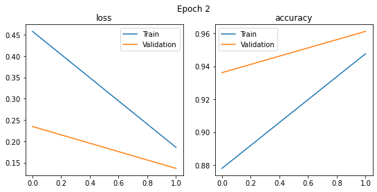
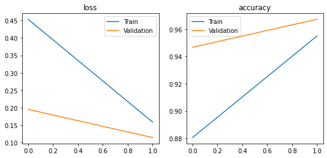

# FancyCallbacks
> Fancy callbacks for Keras. This was created mainly to explore the usage of nbdev. The objective is to compile a series of very simple but usefull callbacks to make your life easier when training models with Keras.


## Install

`pip install fancycallbacks`

## How to use

## `PlotMetricsProgress`

```python
import tensorflow as tf
from tensorflow.keras import layers
from tensorflow.keras.datasets import mnist
```

We can train a very simple MNIST model to see how it would be used:

```python
(X_train, Y_train), (X_test, Y_test) = mnist.load_data()

X_train = X_train[:,:,:,None]/255.0
X_test = X_test[:,:,:,None]/255.0
```

```python
model = tf.keras.Sequential([
    layers.Conv2D(32, 3, padding='same', activation='relu', input_shape=X_train[0].shape),
    layers.MaxPool2D(2),
    layers.Flatten(),
    layers.Dense(10, activation='softmax')
])
model.compile(loss='sparse_categorical_crossentropy',
              optimizer='adam',
              metrics=['accuracy'])
```

```python
history = model.fit(X_train, Y_train, 
                    epochs=2, batch_size=256,
                    validation_data=(X_test, Y_test),
                    callbacks=[PlotMetricsProgress()])
```


    

    


## `PlotMetricsEnd`

We can train a very simple MNIST model to see how it would be used:

```python
(X_train, Y_train), (X_test, Y_test) = mnist.load_data()

X_train = X_train[:,:,:,None]/255.0
X_test = X_test[:,:,:,None]/255.0
```

```python
model = tf.keras.Sequential([
    layers.Conv2D(32, 3, padding='same', activation='relu', input_shape=X_train[0].shape),
    layers.MaxPool2D(2),
    layers.Flatten(),
    layers.Dense(10, activation='softmax')
])
model.compile(loss='sparse_categorical_crossentropy',
              optimizer='adam',
              metrics=['accuracy'])
```

```python
history = model.fit(X_train, Y_train, 
                    epochs=2, batch_size=256,
                    validation_data=(X_test, Y_test),
                    callbacks=[PlotMetricsEnd()])
```

    Epoch 1/2
      1/235 [..............................] - ETA: 1:19 - loss: 2.2925 - accuracy: 0.0977WARNING:tensorflow:Callback method `on_train_batch_end` is slow compared to the batch time (batch time: 0.0069s vs `on_train_batch_end` time: 0.0069s). Check your callbacks.
    235/235 [==============================] - 2s 9ms/step - loss: 0.4532 - accuracy: 0.8805 - val_loss: 0.1954 - val_accuracy: 0.9468
    Epoch 2/2
    235/235 [==============================] - 2s 8ms/step - loss: 0.1588 - accuracy: 0.9551 - val_loss: 0.1147 - val_accuracy: 0.9673


    

    

